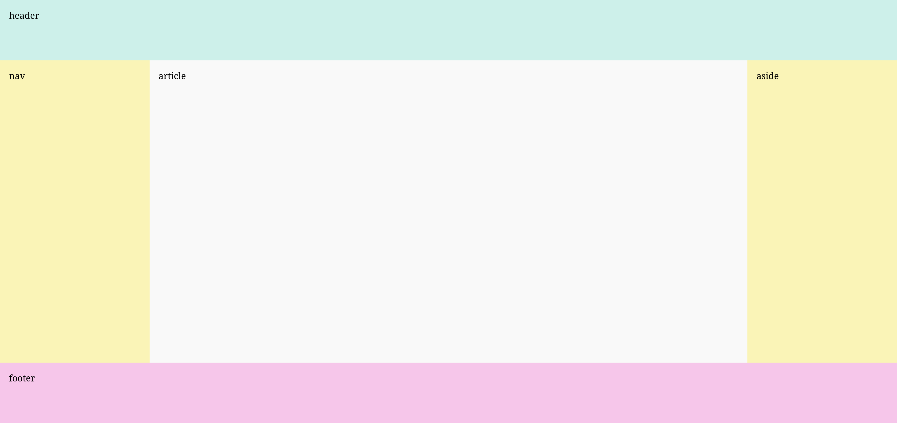
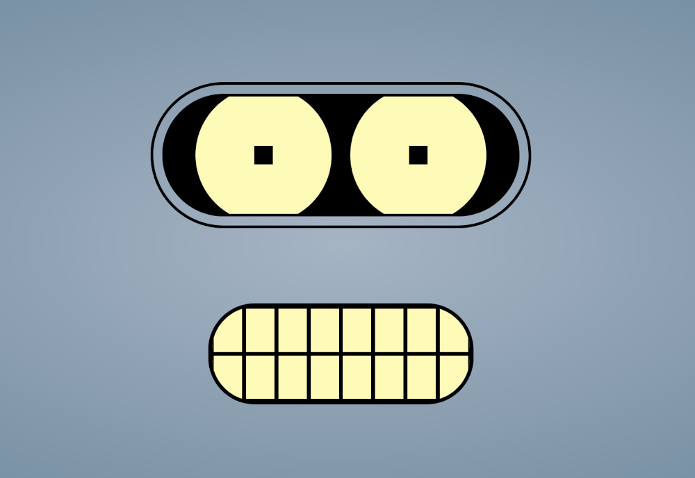
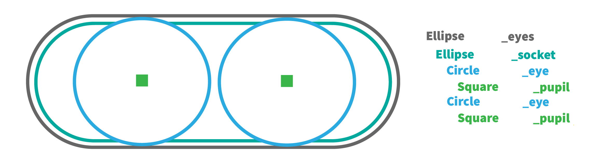
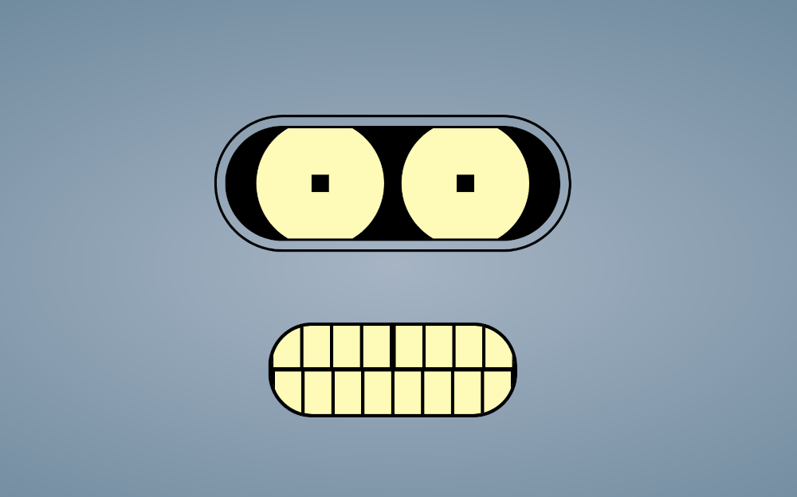

# Laborator 4 - css#2

*Folosiți notele de curs ca să vă amintiți conceptele CSS folosite pentru definirea layoutului (recapitulați proprietățile CSS pentru poziționare și metodele de layout flexbox și grid din cursul 4) și rezolvați următoarele exerciții.*  

## flexbox & grid

1. Jucați [Flexbox Froggy](https://flexboxfroggy.com/) și testați-vă cunoștințele despre metoda de layout flexbox.

2. Jucați [Grid Garden](https://cssgridgarden.com/) și testați-vă cunoștințele despre metoda de layout grid.

## exemplu layout pagină

Descărcați fișierele `layout.html` și `layout-style.css` din directorul `resources`. Sarcina voastră principală este să modificați aceste fișiere. Citiți cu atenție fișierele și rezolvați exercițiile de mai jos, urmând [planul](https://github.com/cechirita/tw2425/blob/main/Laborator%204/resources/images/minion.jpg) lui Felonious Gru.

3. Completați regulile CSS din fișierul `layout-style.css`, înlocuind simbolul `?` cu valori corespunzătoare, astfel încât pagina să arate ca în imaginea de mai jos:

4. Completați regulile CSS din fișierul `layout-style-flex.css`, înlocuind simbolul `?` cu valori corespunzătoare, astfel încât pagina să arate la fel ca mai sus. Care dintre metodele flexbox și grid v-a părut mai potrivită pentru realizarea acestui layout? 

5. [ *extra* ] Creați un fișier CSS nou `layout-style-position.css`. Adăugați reguli CSS ce nu folosesc metodele flexbox sau grid, ci doar proprietăți precum `position`, `float`, `clear` etc., pentru a recrea layoutul din exercițiile 3 și 4. 

6. Folosiți [validatorul CSS](https://jigsaw.w3.org/css-validator/) pentru a corecta eventualele erori sau atenționări pentru fiecare din fișierele CSS cu care ați lucrat la exercițiile de mai sus. 

## mind the gap!

Descărcați fișierele `robot.html` și `robot-style.css` din directorul `resources`. Sarcina voastră principală este să modificați aceste fișiere. 

7. Completați regulile CSS din fișierul `robot-style.css`, înlocuind simbolul `?` cu valori corespunzătoare, astfel încât robotul să arate ca în imaginea de mai jos:

*Hint:
Robotul este construit din figuri geometrice simple. Citiți cu atenție codul ce v-a fost furnizat pentru a înțelege cum se suprapun aceste figuri. Imaginea de mai jos evidențiază figurile folosite pentru a construi ochii robotului.*

8. Modificați fișierele `robot.html` și `robot-style.css` pentru a-i adăuga o [strungăreață](https://www.nowness.com/story/willem-dafoe-grigoriy-dobrygin-mind-the-gap) robotului, ca în imaginea de mai jos. 

*Hint: puteți adăuga elemente noi în fișierul html.*

9. Modificați fișierele `robot.html` și `robot-style.css` pentru a folosi metoda de layout grid. Robotul ar trebui să arate la fel, indiferent de metoda folosită.

10. Folosiți [validatorul CSS](https://jigsaw.w3.org/css-validator/) pentru a corecta eventualele erori sau atenționări. 

## EXTRA

11. Jucați [Flexbox Defense](http://www.flexboxdefense.com/) și testați-vă cunoștințele despre metoda de layout flexbox. Tower power!

 

