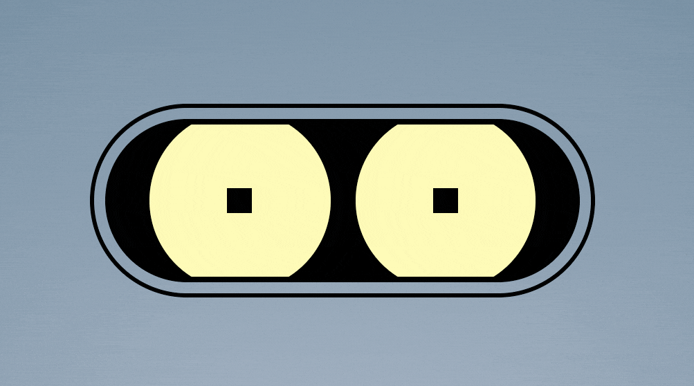
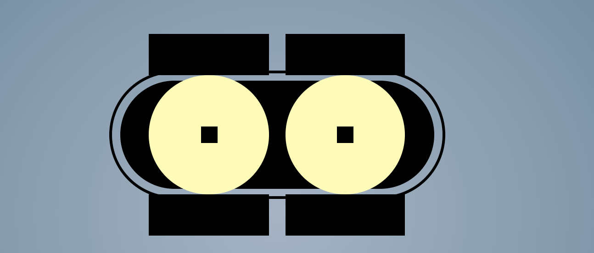
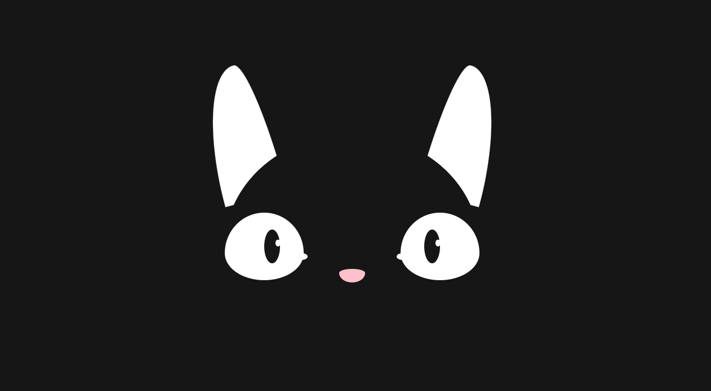
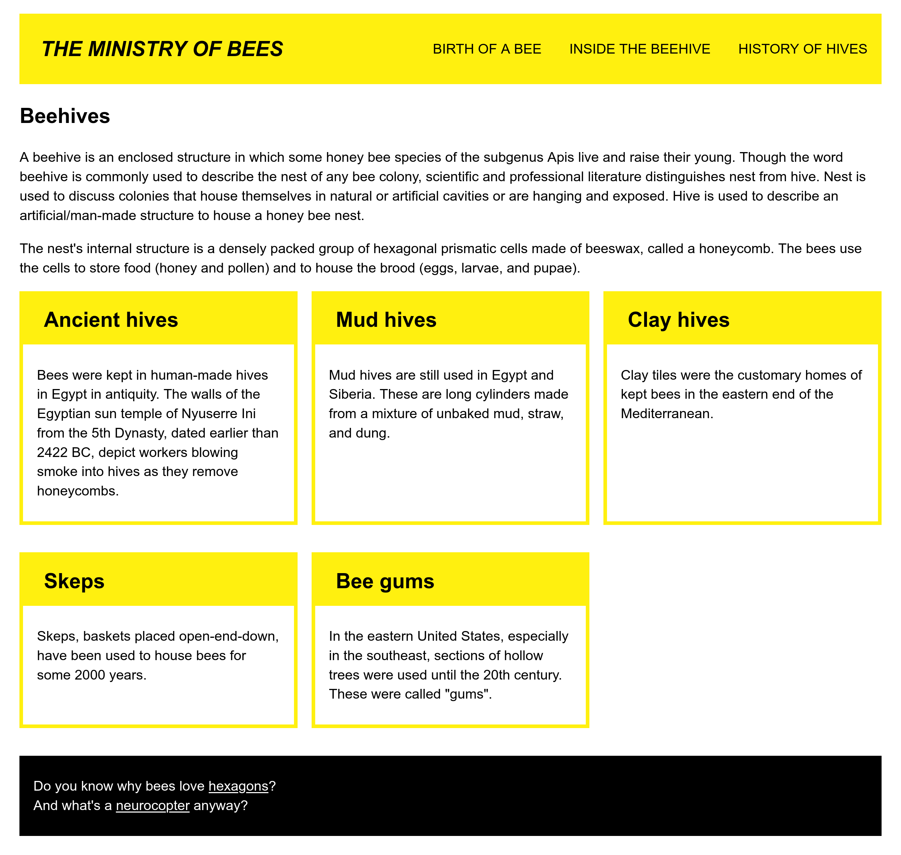
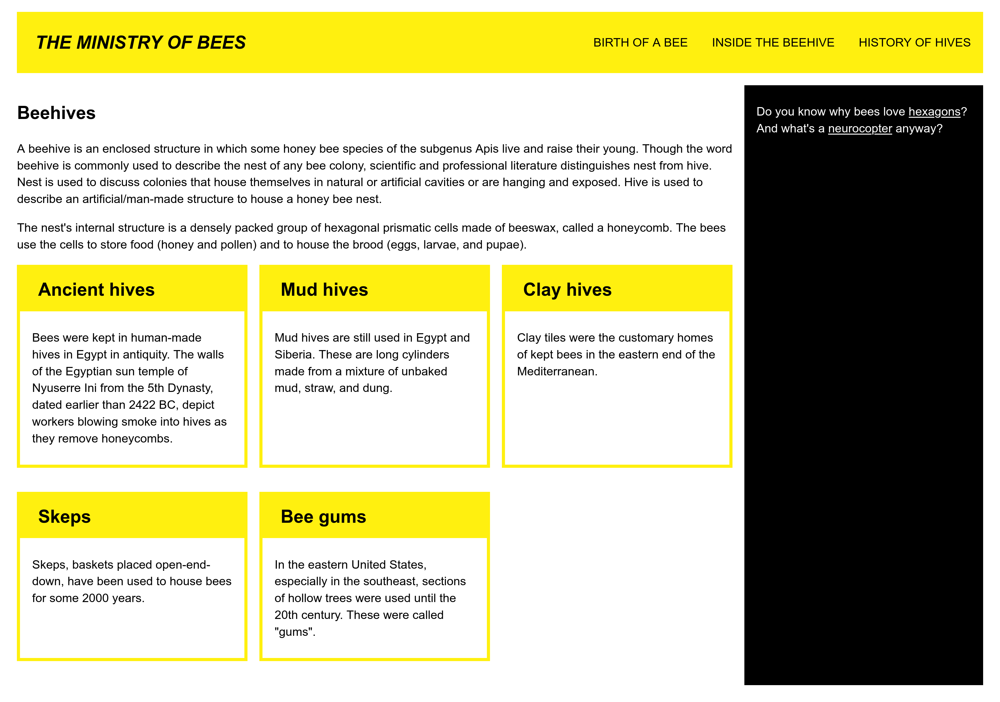
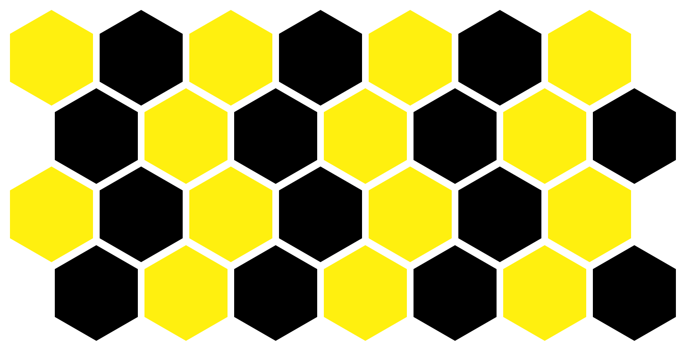
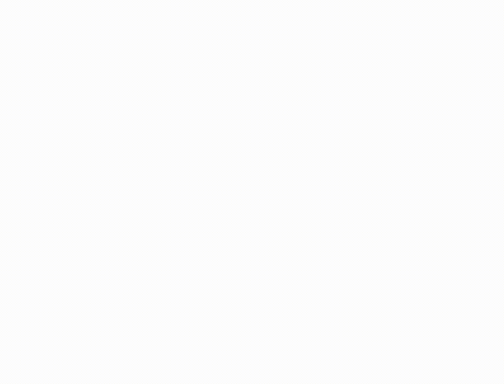

# Laborator 5 - css#3

*Folosiți notele de curs ca să vă amintiți conceptele CSS folosite pentru a crea pagini cu design responsive (recapitulați proprietățile și regulile pentru media queries), transformări, tranziții și animații CSS, și rezolvați următoarele exerciții.*  

## ochişorii lui, mura câmpului

Descărcați fișierele `robot.html` și `robot-style.css` din directorul `resources`. Sarcina voastră este să modificați fișierul CSS. 

1. Vrem să facem robotul să clipească. Mai precis, vrem să se uite la noi cu neîncredere, să se încrunte. Ca în imaginea de mai jos:

Pentru aceasta, am adăugat două elemente care să corespundă pleoapelor, folosind pseudo-elementele CSS `::before` și `::after`. Ele sunt poziționate precum dreptunghiurile negre din imaginea de mai jos, însă nu sunt vizibile din cauza elementului `robot_socket`. Ce regulă CSS a acestui element le ascunde?

 
2. Adăugați reguli CSS pentru pseudo-elementele `robot_eye::before` și `robot_eye::after` astfel încât să creați două animații de clipire, `topEyelid` și `bottomEyelid`. Dorim ca animațiile să dureze 5 secunde, să înceapă cu o întârziere de o secundă, să fie rulate în buclă, și să aibă o viteză mai mică la început și final.

3. Completați regulile CSS pentru definirea punctelor intermediare din animații (keyframes) astfel încât:
- în prima parte a animației, robotul să închidă pleoapele
- apoi să țină pleoapele închise între 20% și 80% din durata animației
- să deschidă pleoapele în ultima parte a animației.  
*Hint: folosiți-vă de dimensiunea pleoapelor pentru a stabili valorile numerice pentru translații.*

*4. (opțional) Adăugați reguli CSS pentru a crea o animație simplă în care robotul să închidă și să deschidă gura.*

## Tigger, Tigger!

*Tigger Tigger, burning bright,  
In the forests of the night;  
What immortal hand or eye,   
Could frame thy fearful symmetry?    
In what distant deeps or skies.   
Burnt the fire of thine eyes?*  

Îl mai țineți minte pe Tigger, pisoiul din primul laborator? Descărcați fișierele `tigger.html` și `tigger-style.css` din directorul `resources`. Citiți cu atenție fișirul CSS și modificați-l pentru a rezolva exercițiile următoare. 

4. Înlocuiți simbolurile ? cu valori potrivite pentru a completa regulile CSS din fișierul `tigger-style.css` în așa fel încât Tigger să arate ca în imaginea de mai sus. 

5. Modificați fișierul pentru a crea două animații:
- una în care Tigger să clipească de două ori, repede: animația să dureze 4s, să ruleze în buclă, și să înceapă mai lent
- una în care Tigger să privească în jur: animația să dureze 4s și să ruleze în buclă.
 
## responsive design

Descărcați fișierele `responsive-design.html` și `responsive-style.css` din directorul `resources`. Citiți cu atenție fișierele și rezolvați exercițiile de mai jos.

6. Pagina `responsive-design.html` are un layout potrivit pentru dispozitive mobile. Vrem însă să avem și o versiune a paginii potrivită pentru ecrane mai mari.  
Completați regulile CSS din fișierul `responsive-style.css`, înlocuind simbolul `?` cu valori corespunzătoare, astfel încât pagina să arate ca în imaginile de mai jos atunci când este încărcată pe ecrane cu dimensiune de cel puțin 40 em, respectiv 80em în lățime:

7. Folosiți [validatorul CSS](https://jigsaw.w3.org/css-validator/) pentru a corecta eventualele erori sau atenționări. 

## bestagons

[*Hexagons are the bestagons!*](https://www.youtube.com/watch?v=thOifuHs6eY)

8. Descărcați fișierele `hexagon.html` și `hexagon-style.css` din directorul `resources`. Citiți cu atenție fișierele și înlocuiți simbolurile ? din fișierul `hexagon-style.css` pentru a desena un hexagon folosind proprietatea CSS [`clip-path`](https://developer.mozilla.org/en-US/docs/Web/CSS/clip-path) și funcția CSS [`polygon`](https://developer.mozilla.org/en-US/docs/Web/CSS/basic-shape/polygon).

9. Descărcați fișierele `hexagon-tiles.html` și `hexagon-tiles-style.css` din directorul `resources`. Citiți cu atenție fișierele și înlocuiți simbolurile ? din fișierul `hexagon-tiles-style.css` pentru a desena o acoperire a paginii cu hexagoane precum în imaginea de mai jos, folosind metoda de layout flex. 
 

10. Modificați fișierul `hexagon-animatiles-style.css` pentru a crea o animație precum cea de mai jos în care colorăm hexagoane la trecerea cu mouse-ul peste ele. Animația trebuie să dureze 4s, să ruleze în buclă, cu viteză liniară.   
Citiți mai întâi despre proprietatea CSS [`filter`](https://developer.mozilla.org/en-US/docs/Web/CSS/filter) și funcția [`hue-rotate`](https://developer.mozilla.org/en-US/docs/Web/CSS/filter-function/hue-rotate). 

## EXTRA

11. Înlocuiți cardurile pătrate din pagina `responsive-design.html` de la exercițiul 6 cu hexagoane.
12. [Unfold the Box Model](https://rupl.github.io/unfold/) ca să recapitulați transformările CSS.
13. Sfârșit de capitol, prilej de joacă: jucați [Guess the CSS](https://www.guess-css.app/) ca să recapitulați conceptele de CSS învățate la curs.
14. Nu trebuie să vă temeți de plictiseală la mijlocul semestrului! Puteți să vă jucați cu CSS [aici](https://css-challenges.com) sau [aici](https://cssbattle.dev/). 
 

