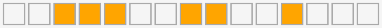

# Laborator 7 - DOM

*Folosiți notele de curs ca să vă amintiți conceptele de bază de DOM și JavaScript din [cursul 7](https://cs.unibuc.ro/~cechirita/tw/c7) și rezolvați următoarele exerciții.*  

## desenați, desenați, desenați

Descărcați fișierele `draw.html`, `style.css` și `draw.js` din directorul `resources`. Sarcina voastră principală este să modificați fișierul JavaScript pentru a dezvolta o mică aplicație web pentru desenat. 

1. Mai întâi vom construi tabla de desenat, ca în imaginea de mai jos.

  
Completați funcția `drawTable` pentru a genera un tabel (element `html` de tip `table`) cu o dimensiune dată (număr de rânduri și număr de coloane) și adăugați-l în `divul` cu id-ul `container` folosind JavaScript și DOM.  

*Hint: Pentru a ușura parcurgerea arborelui DOM în continuare, adăugați fiecărei celule `td` din tabel câte o clasă pentru rândul și coloana pe care se află. De exemplu, primei celule din tabel îi puteți adăuga clasele `"r0"` și `"c0"`.*

2. Scrieți o funcție `colorCol` și una `colorRow` care să coloreze o coloană, respectiv o linie din tabla de desenat cu o culoare dată.

3. Folosiți funcțiile de mai sus pentru a completa definiția funcției `rainbow` care desenează un curcubeu (pe orizontală sau verticală, conform argumentului `target`) precum în imaginile de mai jos. 

  

4. Scrieți o funcție `getNthChild` care returnează al `n`-lea (element) copil al unui element dat.

5. Definiți funcția `drawPixel` pentru a colora o celulă cu o culoare dată.

6. Definiți funcția `drawLine` pentru a desena o linie orizontală sau verticală între două celule date folosind o culoare dată.  
*Opțional: extindeți funcția pentru a desena o linie oarecare, nu doar linii orizontale și verticale. * 

7. Definiția funcția `drawRect` pentru a desena un dreptunghi cu o culoare dată folosind funcția `drawLine`. 

8. Extindeți funcția `drawPixel`: dacă celula de la linia și coloana date ca argument nu există, redimensionați mai întâi tabla de desenat în mod corespunzător, adăugând linii și/sau coloane.

9. Extindeți funcția `drawPixel` pentru a permite specificarea ponderii cu care o celulă va fi colorată cu o culoare dată: 
- dacă ponderea este 1, atunci celula va fi colorată folosind culoarea primită ca argument
- dacă ponderea este 0, atunci celula își va păstra culoarea inițială
- pentru orice altă valoare a ponderii, culoarea inițială și cea nouă vor fi amestecate. De exemplu, dacă ponderea este 0.5, atunci 
   culoarea inițială și cea nouă vor fi amestecate în proporții egale (50%).
*Hint: folosiți culori de forma `rgb(x,x,x)` pentru a simplifica codul. Funcția `colorMixer` primește ca argumente doi întregi ce corespund valorilor unui canal de culoare pentru cele două culori de amestecat și un întreg ce corespunde ponderii de amestecare.*

10. Definiți funcțiile `delRow` și `delCol` ce permit ștergerea unei linii și a unei coloane din tabla de desenat.  
*Hint: dacă ați adăugat clase corespunzătoare poziției fiecărei celule din tabel, nu uitați să actualizați clasele, atunci când este necesar.*

11. Definiți funcția `shiftRow` ce aplică o permutare circulară la dreapta cu un număr de poziții dat elementelor de pe o linie din tabla de desenat.  
*Hint: de exemplu, conținutul liniei de mai jos este deplasat cu 4 poziții.*  
  
  
 
12. Definiți funcția `jumble` pentru a aplica o permutare circulară
   cu un număr aleator de poziții fiecărei linii din tabla de desenat.

## EXTRA

13. Scrieți o funcție `transpose` care transformă tabla de desenat în transpusa ei. Hint: dacă ați adăugat clase corespunzătoare poziției fiecărei celule din tabel, nu uitați să actualizați clasele.

14. Scrieți o funcție `flip` care inversează ordinea copiilor unui obiect DOM. Folosiți funcția pentru a face *flip* tablei de desenat pe orizontală și pe verticală.

15. Definiți funcția `mirror` care oglindește pe orizontală tabla de desenat: ia jumătatea stângă a tablei, îi face flip și o copiază în partea dreaptă a tablei.

16. Definiți funcția `smear` ce întinde culoarea unei celule în celulele învecinate la dreapta conform unei ponderi date ca argument. Ponderea cu care se colorează celulele învecinate se înjumătățește cu fiecare poziție.  
*Hint: folosiți funcția `drawPixelAmount`.*
 

